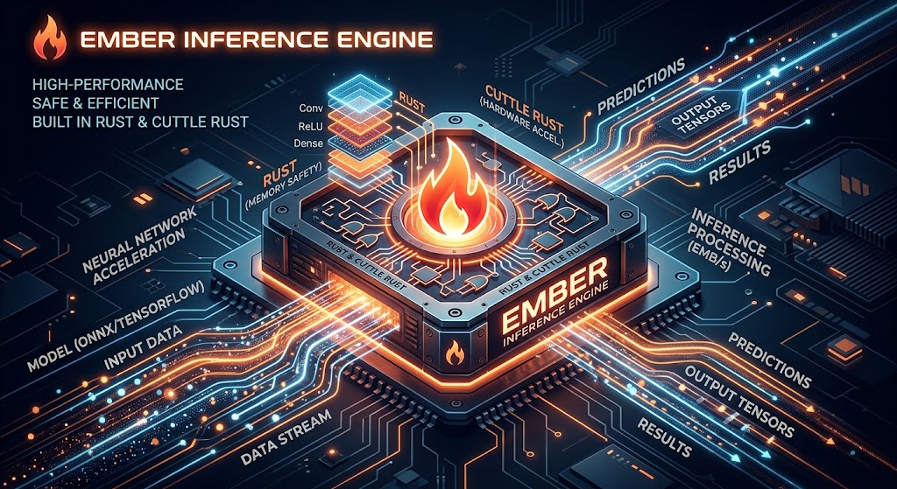

<div align="center">



# Ember

[](https://github.com/huggingface/ember)
[](https://huggingface.github.io/ember)

A Rust, Python and gRPC server for high-performance text generation, used in production at
[Hugging Face](https://huggingface.co) to power Hugging Chat, the Inference API, and
Inference Endpoints.

</div>

---

## Features

- Simple launcher to serve the most popular open-source LLMs
- Production-ready: distributed tracing (OpenTelemetry), Prometheus metrics
- Tensor parallelism across multiple GPUs
- Token streaming via Server-Sent Events (SSE)
- Continuous batching for maximum throughput
- [Messages API](https://huggingface.co/docs/ember/en/messages_api) — OpenAI Chat Completion compatible
- Optimized inference via [Flash Attention](https://github.com/HazyResearch/flash-attention) and
  [Paged Attention](https://github.com/vllm-project/vllm)
- **GPU kernels in safe Rust** via [cuTile Rust](https://github.com/NVlabs/cutile-rs) (NVlabs),
  replacing all legacy CUDA C++ extensions
- Quantization: bitsandbytes, GPTQ, AWQ, EETQ, Marlin, EXL2, fp8
- [Safetensors](https://github.com/huggingface/safetensors) weight loading
- Speculative decoding (~2× latency)
- Structured output / JSON guidance

### Hardware support

| Hardware | Notes |
|----------|-------|
| NVIDIA (H100 / A100 / A10G / T4 +) | CUDA 13.2+, sm_80+ for cuTile kernels |
| AMD (MI210 / MI250) | ROCm image |
| AWS Trainium / Inferentia | Neuron image |
| Intel GPU | XPU image |
| Intel Gaudi | Gaudi image |
| Google TPU | via [optimum-tpu](https://github.com/huggingface/optimum-tpu) |

---

## Quick start (Docker)

```bash
model=HuggingFaceH4/zephyr-7b-beta
volume=$PWD/data

docker run --gpus all --shm-size 1g -p 8080:80 -v $volume:/data \
    ghcr.io/huggingface/ember:latest --model-id $model
```

Query the server:

```bash
# Streaming generation
curl 127.0.0.1:8080/generate_stream \
    -X POST \
    -d '{"inputs":"What is deep learning?","parameters":{"max_new_tokens":50}}' \
    -H 'Content-Type: application/json'

# OpenAI-compatible chat
curl localhost:8080/v1/chat/completions \
    -X POST \
    -d '{
      "model": "ember",
      "messages": [{"role": "user", "content": "What is deep learning?"}],
      "stream": true,
      "max_tokens": 50
    }' \
    -H 'Content-Type: application/json'
```

> Install the [NVIDIA Container Toolkit](https://docs.nvidia.com/datacenter/cloud-native/container-toolkit/install-guide.html)
> to use GPU acceleration. Remove `--gpus all` and add `--disable-custom-kernels` for CPU-only runs.

**AMD:**

```bash
docker run --device /dev/kfd --device /dev/dri --shm-size 1g -p 8080:80 -v $volume:/data \
    ghcr.io/huggingface/ember:latest-rocm --model-id $model
```

**Private / gated models:**

```bash
docker run --gpus all --shm-size 1g -e HF_TOKEN=$HF_TOKEN -p 8080:80 -v $volume:/data \
    ghcr.io/huggingface/ember:latest --model-id meta-llama/Meta-Llama-3.1-8B-Instruct
```

---

## Local install

### One-command setup

```bash
git clone https://github.com/huggingface/ember.git
cd ember

./setup.sh             # GPU machine (CUDA 13.2+, sm_80+)
./setup.sh --cpu-only  # CI / laptop without a GPU
```

Run `./setup.sh --help` for all options including `--python`, `--cuda-arch`, and `--dev`.

### Manual steps

**Requirements:**

| Dependency | Minimum version | Install |
|------------|----------------|---------|
| Rust | 1.85 | `curl --proto '=https' --tlsv1.2 -sSf https://sh.rustup.rs \| sh` |
| protoc | 21+ | See below |
| Python | 3.9 | via uv or conda |
| CUDA *(GPU only)* | 13.2 | [developer.nvidia.com](https://developer.nvidia.com/cuda-downloads) |

**Install protoc (Linux):**

```bash
PROTOC_VERSION=25.3
curl -fOL "https://github.com/protocolbuffers/protobuf/releases/download/v${PROTOC_VERSION}/protoc-${PROTOC_VERSION}-linux-x86_64.zip" \
    -o protoc.zip
sudo unzip -o protoc.zip -d /usr/local bin/protoc
sudo unzip -o protoc.zip -d /usr/local 'include/*'
rm protoc.zip
```

**macOS:** `brew install protobuf`

**Build:**

```bash
# CPU-only (CI / no GPU)
make setup-cpu

# GPU (CUDA 13.2+, sm_80+)
make setup
```

### Nix

```bash
nix run --extra-experimental-features "nix-command flakes" . -- \
    --model-id meta-llama/Llama-3.1-8B-Instruct
```

Requires a binary cache — see [Installation docs](https://huggingface.co/docs/ember/installation) for setup.

---

## GPU kernels

Ember implements its performance-critical GPU operations with
[cuTile Rust](https://github.com/NVlabs/cutile-rs) (NVlabs), a safe tile-based Rust DSL
that compiles to CUDA. All legacy CUDA C++ extensions have been removed.

| Kernel | Operation |
|--------|-----------|
| `masked_softmax_f32/f16/bf16` | Attention softmax with additive mask |
| `q4_matmul` | 4-bit quantized matrix multiply |
| `q4_reconstruct` | Unpack Q4 weights to f16 |
| `column_remap` | Weight column reordering |

Kernels live in `backends/cutile-kernels/` and are compiled as part of the normal
`cargo build`. No separate compilation step is needed.

- `--features cuda` — GPU mode (requires CUDA 13.2+, sm_80+)
- *(no features)* — CPU-stub mode, safe for CI runners without a GPU

See the [GPU kernels guide](https://huggingface.co/docs/ember/conceptual/cutile_kernels) for
full details.

---

## Quantization

```bash
# bitsandbytes 4-bit NF4
docker run ... ghcr.io/huggingface/ember:latest --model-id $model --quantize bitsandbytes-nf4

# GPTQ (pre-quantized model)
docker run ... ghcr.io/huggingface/ember:latest --model-id $model --quantize gptq

# AWQ (pre-quantized model)
docker run ... ghcr.io/huggingface/ember:latest --model-id $model --quantize awq
```

See the [Quantization guide](https://huggingface.co/docs/ember/conceptual/quantization).

---

## Architecture

See [Internal Architecture](https://huggingface.co/docs/ember/architecture) for a detailed
description of the router, model server, GPU kernel layer, and the gRPC call flow.

---

## Develop

```bash
make server-dev   # Python server with hot-reload
make router-dev   # Rust router on port 8080
```

---

## Testing

```bash
make rust-tests           # Rust unit tests (no GPU required)
make python-server-tests  # Python server tests
make python-client-tests  # Python client tests
make integration-tests    # End-to-end integration tests
make lint                 # cargo clippy
```

---

## API reference

- Swagger UI: [https://huggingface.github.io/ember](https://huggingface.github.io/ember)
- Full docs: [https://huggingface.co/docs/ember](https://huggingface.co/docs/ember)

---

## Shared memory note

NCCL (used for tensor parallelism) may use host shared memory. Pass `--shm-size 1g` to
Docker, or mount a `tmpfs` volume at `/dev/shm` in Kubernetes.

## Distributed tracing

Pass `--otlp-endpoint <collector>` to the launcher to emit OpenTelemetry traces. Override
the service name with `--otlp-service-name`.
