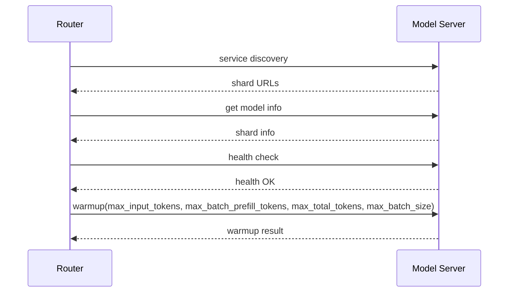
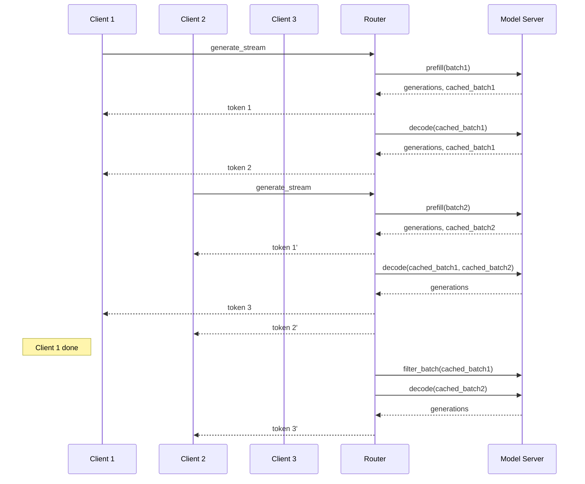

# Ember Architecture

This document describes the architecture of Ember, covering the component call flow,
the GPU kernel layer, and the build system.

## High-level diagram


Three main components work together:

| Component | Language | Responsibility |
|-----------|----------|---------------|
| **Router** (webserver) | Rust | HTTP/gRPC API, request batching, block allocation |
| **Launcher** | Rust | Spawns model server shards, passes config to router |
| **Model server** | Python | Loads model, runs inference, communicates via gRPC |

The router and model server can run on separate machines.

---

## The Router

A Rust web server (`text-generation-router`) that:

- Accepts HTTP requests via the [Ember HTTP API](https://huggingface.github.io/ember/) and
  the [Messages API](https://huggingface.co/docs/ember/messages_api) (OpenAI-compatible).
- Implements continuous batching: queues requests, builds prefill/decode batches, and packs
  them into gRPC calls to the model server.
- Manages paged attention block allocation across requests.
- Exposes Prometheus metrics and OpenTelemetry traces.

The router is backend-agnostic — it speaks the same gRPC protocol regardless of which
model server backend is running.

### Command-line reference

See [All TGI CLI options](./reference/launcher) for the full flag list.

---

## The Model Server

A Python gRPC server that loads a model, optionally shards it across GPUs via tensor
parallelism, and processes prefill/decode requests. It stays alive between requests and
manages its own KV-cache.

### GPU kernels

Performance-critical operations are implemented as Rust GPU kernels using
[cuTile Rust](https://github.com/NVlabs/cutile-rs) from NVlabs (crate:
`backends/cutile-kernels`).  These replace the previous CUDA C++ extension modules.

| Kernel | Purpose |
|--------|---------|
| `masked_softmax_f32/f16/bf16` | Attention score normalisation |
| `q4_matmul` | 4-bit quantized matrix multiply |
| `q4_reconstruct` | Unpack Q4 weights to f16 |
| `column_remap` | Reorder weight matrix columns |

Kernels are JIT-compiled at first use via cuTile and cached for subsequent calls.
CPU-stub builds (compiled without `--features cuda`) return `KernelError::NoGpu`
so the codebase compiles and tests pass on machines without a GPU.

See the [GPU Kernels conceptual guide](./conceptual/cutile_kernels) for full details.

### Model server variants

| Variant | Hardware | Notes |
|---------|----------|-------|
| Default (CUDA) | NVIDIA H100 / A100 / A10G / T4 | sm_80+, CUDA 13.2+ |
| ROCm | AMD Instinct MI210 / MI250 | Some features differ |
| Intel GPU | Intel Arc / Data Center GPU | Some features differ |
| Gaudi | Intel Gaudi 1/2 | Maintained in tgi-gaudi fork |
| Neuron | AWS Trainium / Inferentia2 | Some features differ |
| Google TPU | Cloud TPU | Via optimum-tpu |

---

## The Launcher

`text-generation-launcher` is a thin Rust binary that:

1. Downloads model weights from the Hugging Face Hub.
2. Detects available GPUs and selects the right backend.
3. Spawns one model server shard per GPU (for tensor-parallel models).
4. Starts the router with matching configuration.

---

## Build system

All Rust crates live in a single Cargo workspace. The Python server is managed by
[uv](https://docs.astral.sh/uv/). A unified `setup.sh` script handles both:

```bash
./setup.sh           # GPU machine
./setup.sh --cpu-only --no-server   # CI / no GPU
```

See [Installation from source](./installation) for details.

---

## Call flow

After both components start and weights are downloaded, the router and model server
exchange data and info through gRPC. Two schemas are supported:
[v2](https://github.com/huggingface/ember/blob/main/proto/generate.proto) and
[v3](https://github.com/huggingface/ember/blob/main/proto/v3/generate.proto). v3 adds
input-chunk support (text + image) and paged attention.

**Startup handshake:**



**Inference loop (example with 3 clients):**


